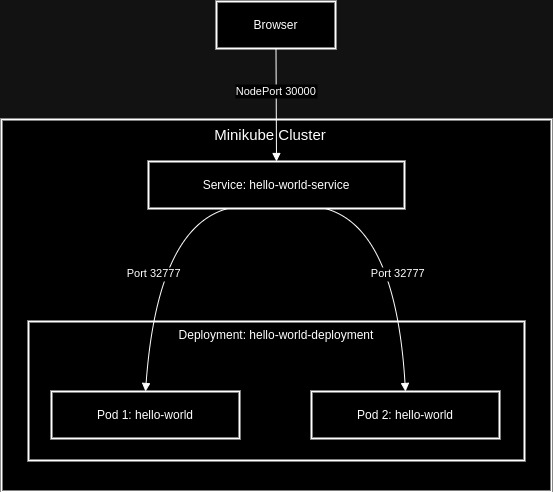

# biocad_task

## Файлы конфигурации

### deployment.yaml

``` yaml
apiVersion: apps/v1
kind: Deployment
metadata:
  name: hello-world-deployment
spec:
  replicas: 2
  selector:
    matchLabels:
      app: hello-world
  template:
    metadata:
      labels:
        app: hello-world
    spec:
      containers:
        - name: hello-world
          image: ners1us/biocad-task:latest
          ports:
            - containerPort: 32777
```

### service.yaml

``` yaml
apiVersion: v1
kind: Service
metadata:
  name: hello-world-service
spec:
  type: NodePort
  ports:
    - protocol: TCP
      port: 32777
      targetPort: 32777
  selector:
    app: hello-world
```

## Команды

### Запуск minikube:
```
➜ minikube start
```
### Применение конфигураций:

```
➜ kubectl apply -f service.yaml                           
service/hello-world-service created
➜ kubectl apply -f deployment.yaml                        
deployment.apps/hello-world-deployment created
```
### Проверка:

```
➜ kubectl get all
NAME                                          READY   STATUS    RESTARTS   AGE
pod/hello-world-deployment-7dcb987fd7-5rqjw   1/1     Running   0          2m1s
pod/hello-world-deployment-7dcb987fd7-bm95j   1/1     Running   0          2m1s

NAME                          TYPE        CLUSTER-IP      EXTERNAL-IP   PORT(S)           AGE
service/hello-world-service   NodePort    10.107.207.37   <none>        32777:30192/TCP   2m14s
service/kubernetes            ClusterIP   10.96.0.1       <none>        443/TCP           2m41s

NAME                                     READY   UP-TO-DATE   AVAILABLE   AGE
deployment.apps/hello-world-deployment   2/2     2            2           2m1s

NAME                                                DESIRED   CURRENT   READY   AGE
replicaset.apps/hello-world-deployment-7dcb987fd7   2         2         2       2m1s

```

### Проброс портов и доступ через браузер:
```
➜  minikube service hello-world-service --url      
http://192.168.49.2:30192
```

## Результат


## Схема
